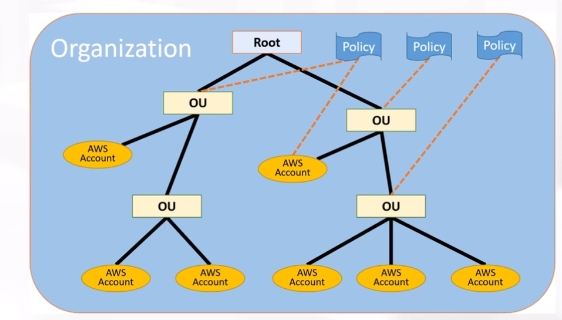

# AWS Organizations

## 概要
- 複数のアカウントを階層構造で管理することができるサービス
- 組織単位（OU、Organization Unit）を作成し、AWSアカウントを紐づけて管理できる
→組織単位でポリシーを一括管理したい場合などに利点がある


## 主な機能
- **Organization API**：アカウント作成を自動化することができる
```
aws organizations create-account --email <メールアドレス> --account-name "<アカウント名>" --role-name <ロール名>
```
- **SCP**：service control policyの略
  - OUに所属するアカウントに対してアクセス権限を制御
  - 上位組織でDenyされているActionは、下位でもDenyされる
  - 上位組織でAllowされているActionは、下位でAllowするかフィルタリングできる
- **一括請求管理**：組織単位での一括請求が可能

## 他サービスとの連携
- **AWS CloudTrail**：OU内のアカウントの証跡を取得することができる
